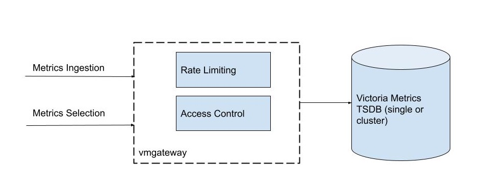

1. Định nghĩa
VictoriaMetrics is a fast, cost-effective and scalable monitoring solution and time series database.

2. Kiến trúc cluster

- vmstorage: lưu trữ dữ liệu thô và trả về dữ liệu truy vấn 
- vminsert: nhận dữ liệu tích hợp và truyền đến các vmstorage nodes dựa theo hàm băm metric name và label.
- vmselect: truy vấn dữ liệu

- vmagent: lấy dữ liệu từ nhiều nguồn, tái gán nhãn và lọc metrics thu thập được và lưu trữ ở VictoriaMetrics thông qua Prometheus "remote_write"

- vmalert: excute alerting và recording rules, sử dụng Alertmanager để cấu hình gửi cảnh báo (-notifier.url)
- vmauth: Xác thực proxy, router, load balancer
- vmbackup: Tạo dữ liệu backup
- vmrestore: phục hồi dữ liệu từ vmbackup
- vmctl:
    - Di chuyển dữ liệu từ Prometheus -> VictoriaMetrics sử dụng snapshot API
    - Di chuyển dữ liệu từ VictoriaMetrics/Thanos/Cortex/Mimir/InfluxDB/OpenTSDB -> VictoriaMetrics
    - Di chuyển dữ liệu từ Prometheus remote read protocol -> VictoriaMetrics
    - Xác minh các blocks xuất ra từ VictoriaMetrics.
- vmgateway:

- vmbackupmanager
- vmanomaly
**Ref:**
https://docs.victoriametrics.com/